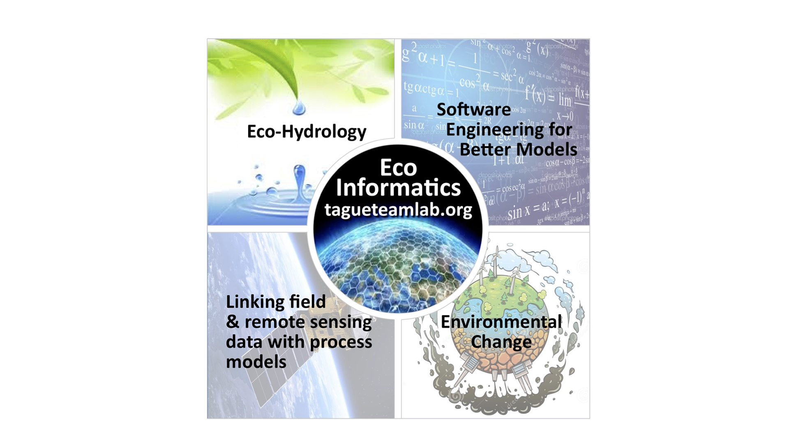

```{r setup, include=FALSE}
knitr::opts_chunk$set(echo = FALSE)
```


## A bit about me


```{r, out.width = "90%", out.height="90%",fig.cap = "Growing skills"}



```


##  <span style="color:orange">Course description</span>

ESM 262 is an introduction to computing for environmental applications. The course provides practical training in software design best practices. 

+ programming language concepts; 
+ modular program design; 
+ data structures and flow control, 
+ version control, 
+ testing, 
+ documentation and reproducibility. 

The course features **R** for programming, **Git** for version control, **Markdown** for workflow, and **GitHub** for collaboration and publishing, but many concepts would be applicable in other software design tools.


Class will include a mix of lectures and hands-on examples, using students' own computers.

## <span style="color:orange">Course where and when</span>

**T/TH** 8:00 AM - 9:15 AM (Bren Hall 1510)

 Teaching Team

**Instructor:** Naomi Tague (www.tagueteamlab.org)

-   **Office hours:** email me
-   **email**  (tague@ucsb.edu)
-   **git user id** naomitague

**Teaching assistant:** Ojas Sarup


-   **Office hours:**  Tuesday / Thursday 3pm-4pm
-   **email** (ojassarup@ucsb.edu )
-   **git user id** osarup


## <span style="color:orange">Learning objectives</span>

- 3 *BIG* concepts in programming are *modularity*, *data structure*, *looping* - we will learn skills related to all three of these

- learn and practice some coding/programming best practices (that will make your data science life easier - whatever you do!)
  - documentation
  - testing

- learn some new Rskills that are helpful for a wide variety of data science applications

- practice partner coding


## <span style="color:orange">Computing set up</span>


-   Make sure you have installed git, R, R-studio

-   Please bring your laptop to class

## <span style="color:orange">Course materials and how we will work</span>

All lecture materials will be available on this course website as well as assignments. (But you will submit assignments on Canvas)

Prior to most classes,  I will ask you to study an Rmarkdown document (and often an example R-functions) before class
Then at the beginning of class, I will **briefly** go over the document and we will discuss any questions. Occasionally I spend 10-15 minutes lecturing. We will spend most of the class working on practical applications of what was in the document.  This way we use the class time as a lab - where you can get guidance.  

**this mean its essential for you to do the review before class **

Why structure it this way?
You learn to code by doing - not so much by watching others do!


## <span style="color:orange">Topics</span> 

|Week| Topic  | Date  | 
|----|--------|---------|
| 1 |Intro | 2025-02-11 | 
| 1 |Modular Design | 2025-02-13 | 
| 2 |Building Functions   | 2025-02-18 |
| 2 |Functions, Data and Error Checking   | 2025-02-20 |
| 3 |Git-Reproducibility   | 2025-02-25 |
| 3 |Git-Conflictss   | 2025-02-27 |
| 4 |Looping    | 2025-03-4 |
| 4 |Control Structures   | 2025-03-6 |
| 5 |Data Structures   | 2025-03-11 |  
| 5 |Testing and Packages   | 2025-03-13 |  


## <span style="color:orange">Assignments</span> 

There will be 5  assignments (more or less one for each week). You will usually have time to work on the assignment in class and most will be in groups. 


# Assignment materials and dates

|Week| Name | Assigned   | Due date   | Group (G) | 
|----|--------|------------|------------|-------|
| 1 |Modular Design | 2025-02-13 | 2025-02-17 | G |
| 2 |Making a function   | 2025-02-18 | 2025-02-24 | I |
| 3 |Using Git with your function   | 2025-02-25 | 2025-03-03 | I |
| 4 |Looping   | 2025-03-4 | 2025-03-10 | I |
| 5 |Functions  and testing | 2025-3-11| 2025-3-18 | G |


# Assignment expectations and grading

- All assignments submitted on Canvas
- Late Assignments 10% each day. Try to submit on time as we build on the concepts and materials covered in each assignment
- Style counts; So make sure your follow good programming practices including adding documentation and using informative variable names
- You can use AI (ChatGPT etc) to help you learn syntax, but write the code yourself; this is how you learn
- You can resubmit your assignment for additional feedback and we will upgrade your grade. Please do so with in one week of getting the assignment back

