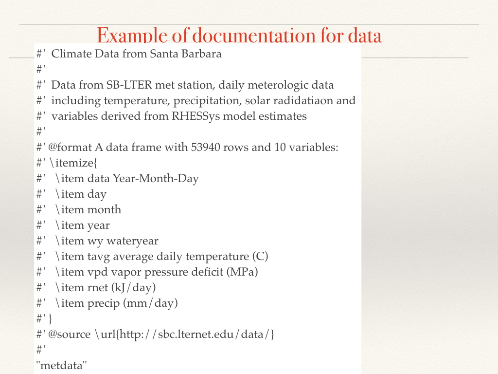

---
title: 'More on packages'
author: "Naomi Tague"
date: "January, 2022"
output:
  slidy_presentation:
   highlight: pygments
  html_document: default
  pdf_document: default
  ioslides_presentation:
    highlight: pygments
---

```{r setup, include=FALSE}
knitr::opts_chunk$set(echo = TRUE)
library(tidyverse)
library(devtools)
library(roxygen2)
```
``
## Accessing existing data stored with packages

To access a dataset that has been stored with a package

**data(name)**

There are numerous data sets stored with the base R package
try 
`data(CO2)'
`help(CO2)'

This is a data set on carbon dioxide uptake in plants - note that it always has help documentation that is similar to functions


You can then refer to that dataset as an object in your workspace

## Storing your own data

*have the dataset (e.g clim) in your workspace

* set working directory to one level above your package directory

* save the data to the data subdirectory of your package using:
  * use_data(name, pkg="packagename")
  * eg. *use_data(clim, pkg=esm237examplesS18)*

* dataset will be stored as data/name.rda in your package

```{r storing data, echo=FALSE, eval=FALSE}

clim=read.table("clim.txt", header=T)
use_data(clim, pkg="../esm237examplesS18", overwrite=TRUE)
data(clim)
```
# <span style="color:orange">Adding Data to your package</span>


## Documenting Data Sets for Packages

Here's an example 

Data Documentation example 

### Steps for documenting data sets

* store documentation as a file (dataname.R) 
 (e.g **R/clim.R**)
save that file in the R subdirectory of your package

* this file will contain ONLY the documentation for the data set

* when you rebuild or run document - documentation will be created with roxygen2

* format is similar to documentation for function but you will use some different identifiers for documentation including:
    * title
    * descripition
    * \@format
    * \@source
    * \\itemize - itemize allows you to describe the data (see example above)

  * end the file with the name of your dataset (in data directory) in quotes
  
  * set your working directory to your project directory 
  
  * once you've generated the documentation - run *document(dataname)* and try *help(dataname)* to test
  


Generate some data and store it with your package


```{r usingdata, echo=FALSE, eval=FALSE}

data(clim)
help(clim)
spring_summary(clim)

```

# <span style="color:orange">Vignettes</span>

Vignettes are additional documentation on how to use your packages (and/or functions
within the package) that provide example uses
* usually written in *Rmarkdown*

You can see available vignettes for all currently loaded packages with

**vignette()**

or for a particular package

**vignette(package="dplyr")**

To actually see the vignette (comes up in help window)
**vignette("two-table")**

Basic outline for making a vignette for your package

* write with *R markdown*
* store in a **vignettes** subdirectory of the package structure
* run **build_vignettes()**

Running **build_vignettes()** will create some additional subdirectories **doc** and **Meta**
after build you need to reinstall with build vignette flag on

**install(buld_vignettes=TRUE)**
**library(package_name)**

and re load your library!

A few technical details first

* add the following to the top of the my-vignette.Rmd (and edit **my_vignette** with your names)

```{black, type='a'}
---
title: "my-vignette"
output: rmarkdown::html_vignette
vignette: >
  %\VignetteIndexEntry{my-vignette}
  %\VignetteEngine{knitr::rmarkdown}
  %\VignetteEncoding{UTF-8}
---
```

* note that you can have more than one vignette in a package

* you may need to add the following lines to **DESCRIPTION**

```{black, type='a'}

Suggests: knitr, rmarkdown
VignetteBuilder: knitr

```

See **esm237examplesS18/vignettes/using_climate_summaries.Rmd**


Try to make a vignette for your function

# <span style="color:orange">Giving the package to others</span>

When you work on the defining the package you use the project of the same name
To give the package to others - (who will simply be using it)

* build a source package (see build directory)

* this will create an *.gz file that you can distribute

* the user will then **install** this package in order to have access to functions and data in your package


