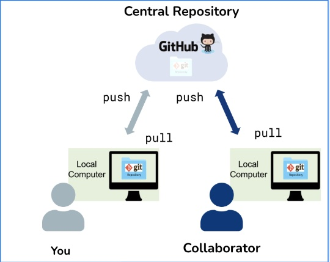
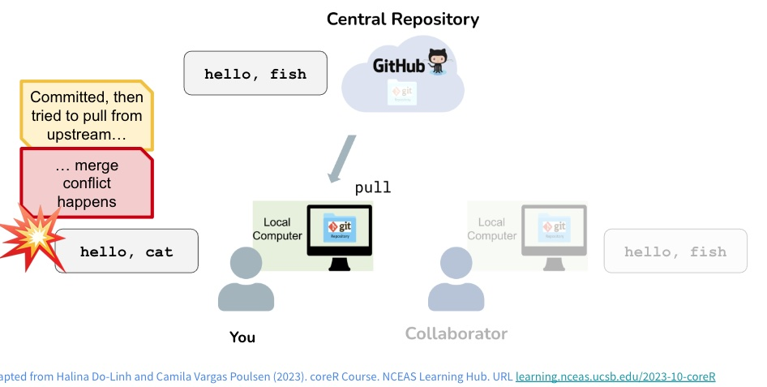

```{r setup, include=FALSE}
knitr::opts_chunk$set(echo = FALSE)
```


# <span style="color:orange"> Git and what to do with it </span>

<span style="color:green">Local Git</span>

* keep track of changes to your code on your computer
* when necessary, go back to early versions

<span style="color:green">GitHub</span>

* access your code from different places
* collaborate with others
  * others who will use your code
  * coding together
 




# <span style="color:orange"> Completed Assignment </span>

Any questions?

Find a partner


# <span style="color:orange"> Collaborations </span>

Steps to collaborate with someone on a repository

There are several ways - we will cover the most common

1. Personal Repositories add collaborators

    * Settings -> Manage Access -> Invite a collaborator
    * Write access for collaborators that can push changes
    * They will get an email and need to accept
  
2. Clone your partner's repository on your computer

3. Make a change and push it back to the repository

# <span style="color:orange"> How conflicts occur </span>



# Demo

I'll show you in my own work flow then I'll have you try with a partner

**Note**

* I'm going to edit directly on *github*, we haven't covered this but good to know you can do it
* You can have multiple copies of your *repo* (e.g on different computers); *github* will be the centralized *repo*, all push and pulls go through there


# Lets Try it

With your partner

1. Open your own repository
2. Before you *pull* your partners changes, make a change to the same file
3. Now try to *pull*


# <span style="color:orange"> Resolving conflicts </span>


Git will tell you when there is a conflict AND edit the file to show you the conflict

it used 
<<<<<< HEAD
changes you are trying to make
======
what was there before
>>>>>>
  
What to do!

1. Edit the file to resolve the conflict including removing the <<<<<<<, ======, >>>>>>)
2. Save the file
3. Add the file
4. Commit the file
5. Push to Github


# <span style="color:orange"> For next class: Re-submit Assignment </span>

1. Based on any feedback or suggested changes from your partner, update your repository
for Assignment 3

We will grade based on the last commit by tomorrow morning


# <span style="color:orange"> A bit more </span>

Sometime you want to play with code on your own without impacting the *main*
repository

Useful for testing, adding features to more complex code, etc.

You can *fork* a repository (make a copy) and then *clone* it to your computer

You can then *merge* changes back to the original repository

This works well for independent exploration


You can also create a *branch* which is version of all the files in the same repository; its a bit less independent - and you can do from the *git* pane in Rstudio

One way to think about it..

* branches are part of the same tree
* forks are different trees


Details on how to do this and other git commands 

[Happy Git](https://happygitwithr.com/) 

