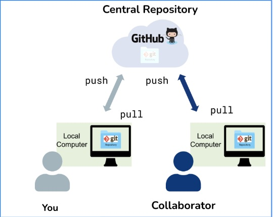
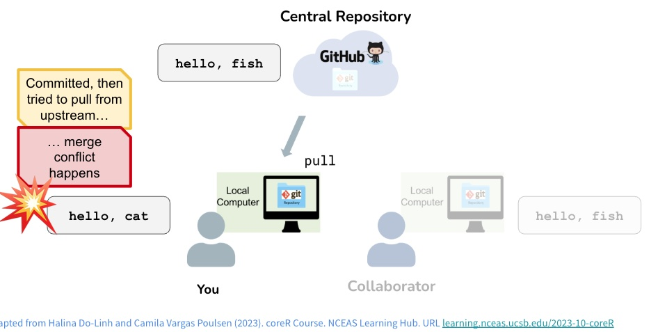

```{r setup, include=FALSE}
knitr::opts_chunk$set(echo = FALSE)
```


# <span style="color:orange"> Git and what to do with it </span>

<span style="color:green">Local Git</span>

* keep track of changes to your code on your computer
* when necessary, go back to early versions

<span style="color:green">GitHub</span>

* access your code from different places
* collaborate with others
  * others who will use your code
  * coding together
 




# <span style="color:orange"> Completed Assignment </span>

Any questions?

Find a partner


# <span style="color:orange"> Collaborations </span>

Steps to collaborate with someone on a repository

There are several ways - we will cover the most common

1. Personal Repositories add collaborators

    * Settings -> Manage Access -> Invite a collaborator
    * Write access for collaborators that can push changes
    * They will get an email and need to accept
  
2. Clone your partner's repository on your computer
    * Start a new project from an existing git repository
    * Use the web link from your partner's GitHub repository

3. Make a change and push it back to the repository
    * edit one of the files
    * commit the change
    * push to GitHub
    * check to make sure each other's changes are in GitHub

# <span style="color:orange"> How conflicts occur </span>



# Demo

I'll show you in my own work flow then I'll have you try with a partner

**Note**

* I'm going to edit directly on *github*, we haven't covered this but good to know you can do it
* You can have multiple copies of your *repo* (e.g on different computers); *github* will be the centralized *repo*, all push and pulls go through there


# <span style="color:orange"> Resolving conflicts </span>


Git will tell you when there is a conflict AND edit the file to show you the conflict

it used 
<<<<<< HEAD
changes you are trying to make
======
what was there before
>>>>>>
  
What to do!

1. Edit the file to resolve the conflict including removing the <<<<<<<, ======, >>>>>>)
2. Save the file
3. Add the file
4. Commit the file
5. Push to Github

# Lets Try it

With your partner

1. Open your own repository
2. Before you *pull* your partners changes, make a change to the same file in the same place in the file
3. Now try to *pull*
4. Figure out how you want to resolve the confict
5. Resolve it 
6. Save, Add, Commit the file

# Going backward

If you haven't commited the file...

*Revert*

(from git menu)

Try it - make a mistake, save the file, then revert

# What if I commited my changes to a file, can I get it back


1. make an "incorrect" change and save

2. commit the change

3.  go to 'history' in the 'git' window
    Notice that every commit has a unique "SHA"

4.  find the commit that you want to go back to before the mistake

5. check that its what you want by looking at the changes

6. View that older version of the file and save it to the same name

7. Go to commit, notice the changes and commit this  "older" version

# Go back to an entire commit (more than just one file)

git reset from the command line - be careful with this one

# <span style="color:orange"> For next class: Re-submit Assignment </span>

1. Based on any feedback or suggested changes from your partner, update your repository
for Assignment 3

# <span style="color:orange"> A bit more </span>

Sometime you want to play with code on your own without impacting the *main*
repository

Useful for testing, adding features to more complex code, etc.

You can *fork* a repository (make a copy) and then *clone* it to your computer

You can then *merge* changes back to the original repository

This works well for independent exploration


You can also create a *branch* which is version of all the files in the same repository; its a bit less independent - and you can do from the *git* pane in Rstudio

One way to think about it..

* branches are part of the same tree
* forks are different trees


Details on how to do this and other git commands 

[Happy Git](https://happygitwithr.com/) 

